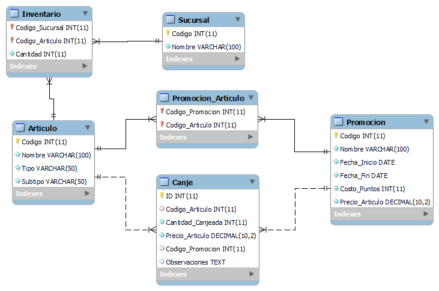

#   RESPUESTAS

- [RESPUESTAS](#respuestas)
- [INCISO 1](#inciso-1)
  - [Login](#login)
  - [Tarjeta](#tarjeta)
- [INCISO 2](#inciso-2)
- [INCISO 3](#inciso-3)
- [INCISO 4](#inciso-4)
- [INCISO 5](#inciso-5)


#   INCISO 1

[Login y Tarjeta aspx](tarjetas_asp)

##  Login

    https://localhost:44396/login.aspx

Credenciales de prueba

    user: admin
    password: password

##  Tarjeta

    https://localhost:44396/tarjeta.aspx


#   INCISO 2

[Tarjeta soap](tarjeta_soap)

    https://localhost:44351/tarjeta.asmx

#   INCISO 3

A.  Escriba la consulta en SQL que devuelva el nombre del proyecto y sus productos correspondientes del proyecto premia cuyo código es 1.


```sql
SELECT P.NOMBRE AS Proyecto, PR.DESCRIPCOIN AS Producto
FROM PROYECTO P
JOIN PRODUCTO_PROYECTO PP ON P.PROYECTO = PP.PROEYCTO
JOIN PRODUCTO PR ON PP.PRODUCTO = PR.PRODUCTO
WHERE P.PROYECTO = 1;

```

B.	Escriba una consulta SQL que devuelva los distintos mensajes que hay, indicando a qué proyecto y producto pertenecen.


```sql
SELECT M.COD_MENSAJE, P.NOMBRE AS Proyecto, PR.DESCRIPCOIN AS Producto
FROM MENSAJE M
JOIN PROYECTO P ON M.PROYECTO = P.PROYECTO
JOIN PRODUCTO PR ON M.PRODUCTO = PR.PRODUCTO;

```

C.	Escriba una consulta SQL que devuelva los distintos mensajes que hay, indicando a qué proyecto y producto pertenecen. Pero si el mensaje está en todos los productos de un proyecto, en lugar de mostrar cada producto, debe mostrar el nombre del proyecto y un solo producto que diga “TODOS”.

```sql
SELECT DISTINCT M.COD_MENSAJE, P.NOMBRE AS Proyecto,
    CASE
        WHEN EXISTS (
            SELECT 1 FROM PRODUCTO_PROYECTO PP
            WHERE PP.PROEYCTO = M.PROYECTO
            EXCEPT
            SELECT 1 FROM MENSAJE M2 WHERE M2.PROYECTO = M.PROYECTO AND M2.PRODUCTO = M.PRODUCTO
        )
        THEN PR.DESCRIPCOIN
        ELSE 'TODOS'
    END AS Producto
FROM MENSAJE M
JOIN PROYECTO P ON M.PROYECTO = P.PROYECTO
JOIN PRODUCTO PR ON M.PRODUCTO = PR.PRODUCTO;
```

#   INCISO 4

[DatabaseHelper](tarjetas_asp/App_Data/DatabaseHelper.cs)

#   INCISO 5


